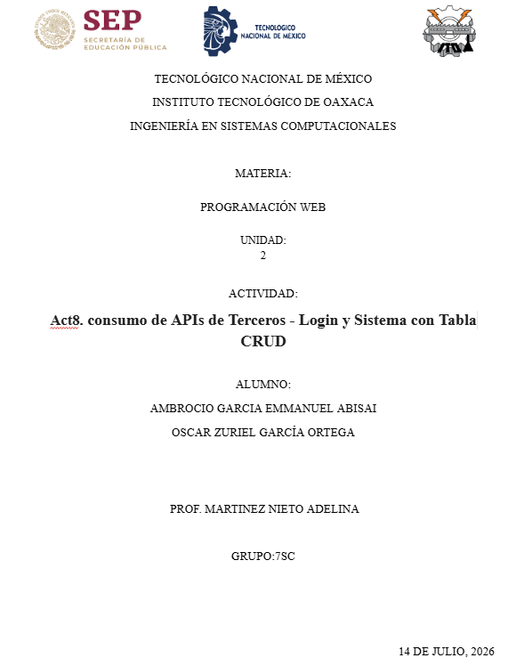
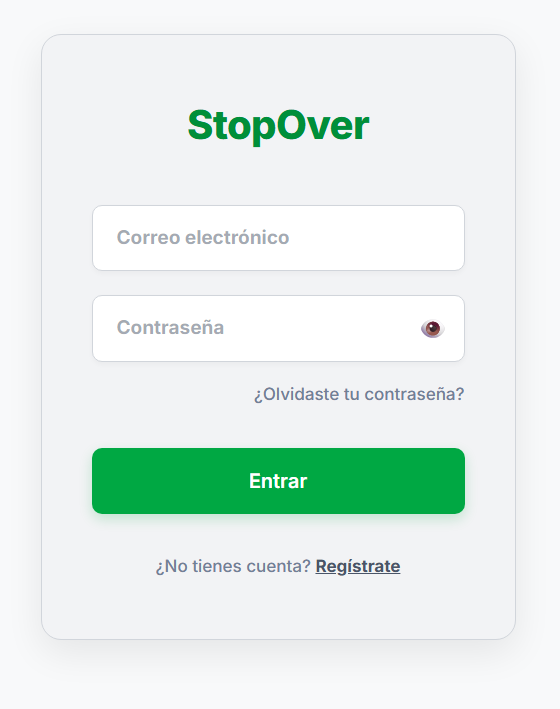
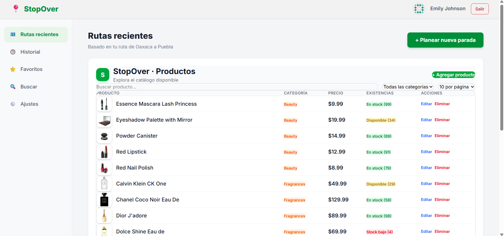
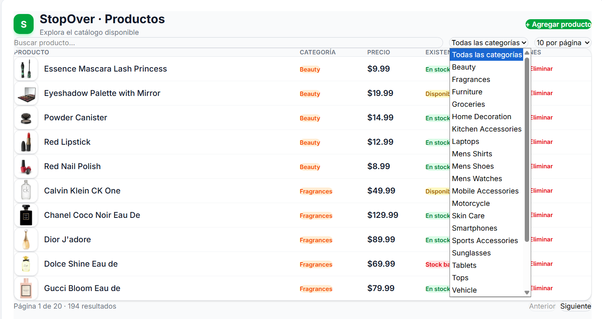
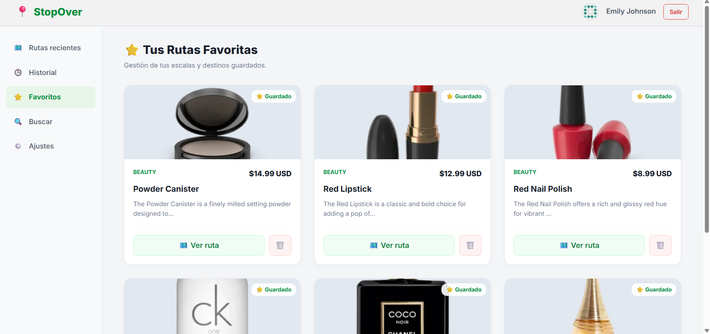

# StopOver - Sistema de Gestión y Planeación de Rutas

Actividad 8: Consumo de APIs de Terceros - Login y Sistema con Tabla CRUD

---




### Division de trabajo

1. **Oscar Zuriel García Ortega** — Login, autenticación, layout principal, protección de rutas y módulo de Favoritos.
2. **Emmanuel Abisai Ambrocio Garcia** — Consumo de la API para la tabla de datos, sistema de filtros, paginación sincronizada con la URL y acciones CRUD.

---

## Enlace de despliegue en VPS 

- URL del sistema desplegado: http://18.188.66.230/t3_act8_eq06/
- API elegida para la tabla CRUD: [DummyJSON Products](https://dummyjson.com/products)
- API elegida para autenticación: [DummyJSON Auth](https://dummyjson.com/auth/login)
- Link de repositorio: https://github.com/OscarZurielGarciaOrtega/t3_act8_eq06

---

## Cumplimiento de la rúbrica de evaluación 

### Login funcional con validación

- Conexión mediante POST al endpoint `https://dummyjson.com/auth/login`.
- Validación en el formulario para evitar el envío de campos vacíos.
- Mensaje de error visible para el usuario cuando las credenciales son incorrectas ("Usuario o contraseña incorrectos").
- Los datos del usuario se guardan en el estado de la aplicación (`useState`) y en `localStorage`, para mantener la sesión al recargar.

### Sistema simulado y protección de vistas 

- Navbar con la foto de perfil, nombre de usuario y botón de "Cerrar sesión" funcional.
- Sidebar con opciones de navegación y resaltado de la vista activa.
- Protección de rutas en `App.jsx`: si no hay sesión activa, el sistema redirige al Login automáticamente.

### Tabla de datos, filtros, paginación y CRUD 

## Filtros  
Búsqueda por texto (nombre/título) y filtro por categoría, ambos sincronizados con la URL.

**Paginación sincronizada con la URL**
Botones de "Anterior" y "Siguiente", más un selector de cantidad de registros por página (10, 20, 40, 50). El número de página y el límite se reflejan en los parámetros de la URL mediante `useSearchParams` (por ejemplo `?page=2&limit=20`), lo que permite compartir el enlace o usar el botón de regresar del navegador.

**Acciones CRUD.**
- Agregar: formulario para crear un nuevo producto, con confirmación antes de enviarlo.
- Editar: modificación de un registro existente, con confirmación antes de aplicar el cambio.
- Eliminar: borrado de un registro, con confirmación antes de ejecutarlo.
- En los tres casos, primero se hace la petición real a la API (POST/PUT/DELETE) y después se actualiza el estado local (`useState`) para reflejar el cambio en la tabla.

**Estados de carga y error**
Indicador de "Cargando..." mientras se obtienen los datos, y mensaje de error si la petición falla.

### Buenas prácticas de código 

**Despliegue en VPS**
Configuración de `base: '/t3_act8_eq06/'` en `vite.config.js`, generación del build con `npm run build` y despliegue en el servidor Nginx del equipo.

**Organización del código**
- Componentes separados y reutilizables: `Navbar`, `Sidebar`, `DataTable`, `FavoriteCard`, `Login`, `Dashboard`.
- Llamadas HTTP centralizadas en `src/services/Api.js`, separadas de la lógica visual.
- Nombres descriptivos para funciones y variables (por ejemplo `handleLoginSuccess`, `handleRemove`).
- Commits descriptivos por rama, uno por integrante (`feat/login-layout` y `tabla-filtros-crud`).
- `.gitignore` configurado para excluir `node_modules` y archivos temporales.

---

## Estructura del proyecto

```text
t3_act8_eq06/
├── src/
│   ├── components/
│   │   ├── DataTable.jsx       
│   │   ├── ConfirmModal.jsx    
│   │   ├── FavoriteCard.jsx    
│   │   ├── Navbar.jsx          
│   │   └── Sidebar.jsx         
│   ├── pages/
│   │   ├── Dashboard.jsx       
│   │   ├── Favorites.jsx       
│   │   └── Login.jsx           
│   ├── services/
│   │   └── Api.js              
│   ├── App.jsx                
│   ├── main.jsx                 
│   └── index.css               
├── public/
├── index.html
├── package.json
├── vite.config.js              
└── README.md
```

---

## Capturas del sistema









